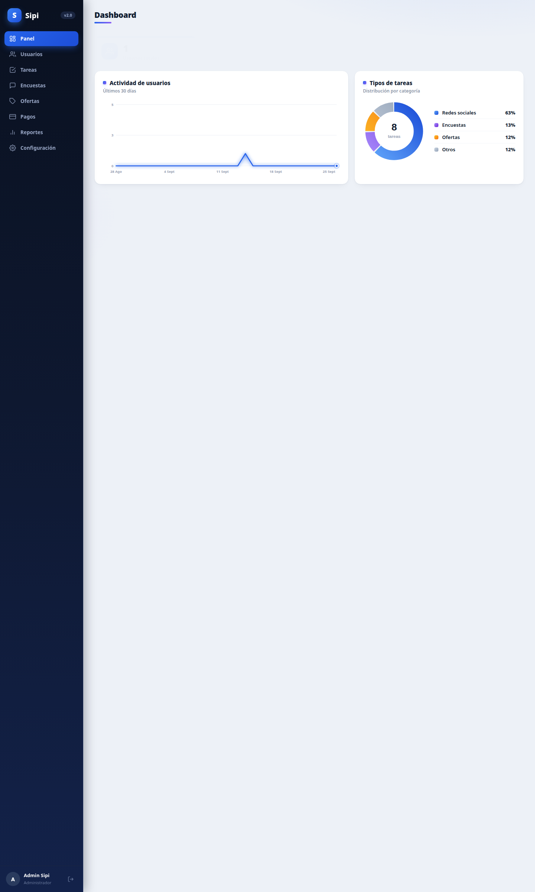
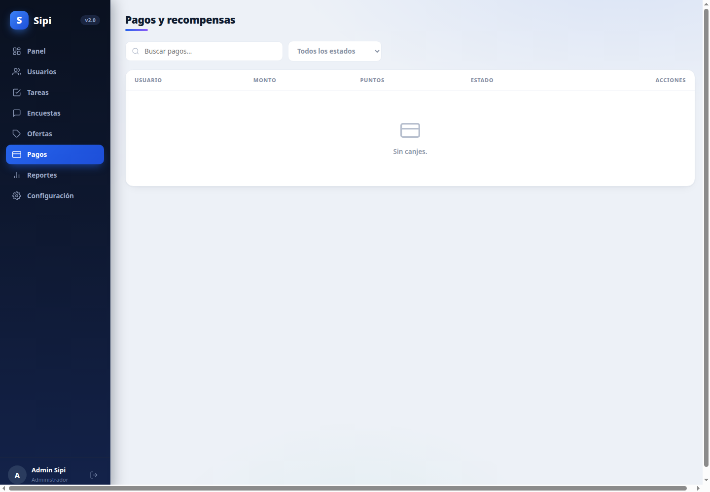

# Sipi — Panel de administración

Panel web para administrar la plataforma: usuarios, tareas, encuestas,
canjes y configuración. Es **un solo archivo** (`index.html`, HTML + CSS +
JS vanilla, sin build ni dependencias externas).




## Correr

```bash
# 1. Backend arriba (puerto 3000)
cd ../backend && npm start

# 2. Servir el panel (puerto 8080) — en otra terminal
python3 -m http.server 8080

# 3. Abrir http://localhost:8080 y entrar con:
#    admin@sipi.app / admin123   (se crea con `npm run seed`)
```

> El panel detecta el puerto 8080 y apunta la API a `http://localhost:3000`.
> Si lo sirves desde otro origen, ajusta la constante `API` en `index.html`.

## Cómo funciona

- **SPA sin framework**: el menú lateral llama a `go(pagina)` y cada vista
  (`vPanel`, `vUsuarios`, `vTareas`, `vEncuestas`, `vOfertas`, `vPagos`,
  `vReportes`, `vConfig`) renderiza su HTML con template strings y lo inyecta
  en el contenedor principal.
- **Auth**: login contra `POST /api/auth/login`; el JWT se guarda en
  `localStorage` (`sipi_admin_token`) y se envía como `Bearer` en cada
  `fetch` (helper `req()`).
- **Gráficas en SVG puro**: área de actividad (30 días) y dona de tipos de
  tareas. La dona usa reparto por resto mayor para que la leyenda sume
  exactamente 100%.
- **Seguridad**: todo texto dinámico se escapa (`h()`) para evitar XSS.
- **Sin datos inventados**: las tarjetas muestran valores reales del
  `GET /api/admin/stats`; no hay porcentajes ni deltas hardcodeados.

## Páginas

| Página | Qué hace |
|---|---|
| **Panel** | Tarjetas: Usuarios totales, Tareas activas, Encuestas activas, Pagos realizados. Gráfica de actividad de usuarios (30 días). Dona de tipos de tareas por categoría. Acceso directo a envíos por revisar. |
| **Usuarios** | Buscador; tabla con avatar, puntos, nivel, rol y estado; acciones: hacer/quitar admin, activar/desactivar (`PATCH /api/admin/users/:id`). |
| **Tareas** | Buscador + filtro por categoría; **Crear tarea** (modal); tabla con título, categoría, puntos, estado; acciones: activar/pausar, editar, adjuntar encuesta. Pestaña **Por revisar**: aprobar (`POST …/approve`, acredita puntos) o rechazar envíos. |
| **Encuestas** | Editor de preguntas por tarea: tipos única, múltiple, sí/no, escala y texto; opciones y obligatoriedad configurables (`POST /api/admin/tasks/:id/survey`). |
| **Ofertas** | Gestión de tareas de categoría `promociones`. |
| **Pagos** | Buscador + filtro por estado; tabla de canjes (usuario, monto, puntos, fecha, estado); marcar como pagado (`…/complete`) o rechazar (`…/reject`, devuelve los puntos vía `REVERSAL`). |
| **Reportes** | Usuarios totales, puntos emitidos, pagado a usuarios, % de usuarios con puntos; crecimiento 30 días; top 5 por saldo; canjes por estado. Botón Imprimir. |
| **Configuración** | Conversión global puntos→USD (`PUT /api/admin/config`). La app la lee de `/api/config`; nunca está hardcodeada. |

## Diseño

Ver [../docs/DISENO.md](../docs/DISENO.md): sidebar navy con píldora activa
en degradado, tarjetas con barra de acento e iconos con brillo, títulos con
subrayado degradado, animación de entrada en tarjetas.

## Archivos

```
admin/
├── index.html   # todo el panel (HTML + CSS + JS)
└── README.md    # este archivo
```
