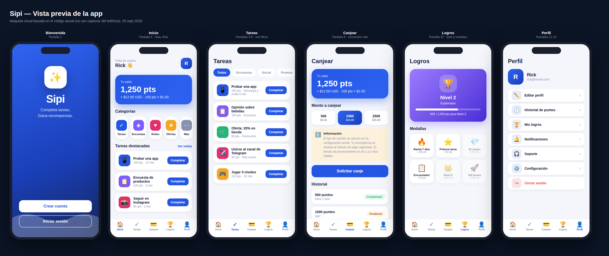

# Sipi — App móvil (Flutter)

App de recompensas por tareas: gana puntos completando tareas y canjéalos
por dinero. 17 pantallas según el mockup.


*(Maqueta visual generada del código — ver [../docs/preview-app.html](../docs/preview-app.html))*

## Requisitos

- Flutter SDK 3.4+
- Backend corriendo (`../backend`: `npm start` en `http://localhost:3000`)

## Correr

```bash
flutter pub get
flutter run
```

La app apunta por defecto a `http://10.0.2.2:3000` (localhost visto desde el
emulador Android). Para un dispositivo físico o iOS, cambia `baseUrl` en
`lib/core/api.dart` por la IP de tu máquina en la red local.

```bash
flutter analyze  # sin issues
flutter test     # 6/6
```

Para generar el APK: `flutter build apk --release`.

## Estructura

```
lib/
├── main.dart            # entrada: Welcome ↔ MainShell según sesión
├── core/
│   ├── theme.dart       # SipiColors + estilos (única fuente de colores)
│   ├── models.dart      # modelos espejo de la API
│   ├── api.dart         # cliente HTTP (el servidor calcula los montos)
│   └── session.dart     # sesión: usuario, token, saldo
├── widgets/
│   └── common.dart      # SipiButton, BalanceCard, SectionHeader, pills…
└── screens/
    ├── welcome_auth.dart  # bienvenida, registro, login
    ├── home.dart          # shell + bottom nav + inicio
    ├── tasks.dart         # lista, detalle y éxito de tarea
    ├── surveys.dart       # respuesta de encuestas
    ├── redeem.dart        # canjear + historial de pagos
    ├── achievements.dart  # nivel e insignias
    └── profile.dart       # perfil, historial de puntos, notificaciones,
                           # soporte, configuración, más, pantalla final
```

## Pantallas (17 del mockup)

| # | Pantalla | Archivo |
|---|---|---|
| 1 | Bienvenida | `welcome_auth.dart` |
| 2 | Registro | `welcome_auth.dart` → lleva a agradecimiento |
| 3 | Inicio de sesión | `welcome_auth.dart` |
| 4 | Inicio (saldo, categorías, destacadas) | `home.dart` |
| 5–6 | Tareas (lista con filtros por categoría) | `tasks.dart` |
| 7 | Detalle / verificación de tarea | `tasks.dart` |
| 8 | Encuestas | `surveys.dart` |
| 9 | Canjear recompensas | `redeem.dart` |
| 10 | Historial de pagos | `redeem.dart` |
| 11 | Puntos y logros | `achievements.dart` |
| 12 | Perfil | `profile.dart` |
| 13 | Notificaciones | `profile.dart` |
| 14 | Soporte (FAQ reales) | `profile.dart` |
| 15 | Configuración | `profile.dart` |
| 16 | Más / Menú | `profile.dart` |
| 17 | Pantalla final (agradecimiento) | `profile.dart` |

## Decisiones de diseño

- **Sin botones muertos**: cada elemento táctil hace algo real (navega,
  abre un diálogo con información verdadera, copia al portapapeles o avisa
  honestamente "estará disponible próximamente").
- **Colores centralizados**: todo pasa por `SipiColors` en `theme.dart`;
  nada hardcodeado en las pantallas. Ver [../docs/DISENO.md](../docs/DISENO.md).
- **Conversión real**: `BalanceCard` recibe `pointsPerUsd` del servidor
  (`GET /api/config`); nunca hay un valor fijo en el código.
- **Contraste accesible**: el estado "Pendiente" usa `warningDark`
  (`#B45309`) sobre fondo ámbar suave, no el ámbar puro.
- **Sin fotos de personas**: logo e iconos son insignias con gradiente.

## Sesión y datos

`Session` (en `core/session.dart`) guarda token y usuario, expone el saldo
(`GET /api/balance`) y notifica cambios a la UI. El cliente nunca calcula
montos: los puntos por tarea y la conversión a USD vienen del servidor.
